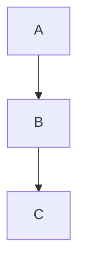

# 绘图工具

生成结构化图表（Mermaid）或自定义矢量图形（cli-anything-inkscape）。

## 工具选择

| 需求 | 工具 | 典型用例 |
|------|------|----------|
| 流程图、时序图、ER 图、甘特图、思维导图 | **Mermaid** | 研究流程、系统架构、数据关系 |
| 自定义矢量图、信息图、论文配图 | **cli-anything-inkscape** | 实验示意图、概念图、精排版图表 |

---

## 工具 1：Mermaid 结构化图表

### 支持的图表类型

- `flowchart` — 流程图（研究流程、算法步骤）
- `sequenceDiagram` — 时序图（系统交互、实验步骤）
- `erDiagram` — 实体关系图（数据库、数据结构）
- `gantt` — 甘特图（研究计划、项目时间线）
- `mindmap` — 思维导图（概念梳理、文献综述框架）
- `classDiagram` — 类图（软件架构）
- `pie` — 饼图（数据分布）
- `xychart-beta` — 折线/柱状图

### 使用方式

**方式 A：Python 生成 SVG（推荐，零依赖）**

```python
# 安装：pip install mermaid-py
from mermaid import Mermaid
from mermaid.graph import Graph

graph = Graph(
    'flowchart',
    """
    flowchart LR
        A[数据采集] --> B[预处理]
        B --> C{质量检查}
        C -->|通过| D[模型训练]
        C -->|失败| B
        D --> E[评估]
    """
)
diagram = Mermaid(graph)
diagram.to_svg('workspace/pipeline.svg')
diagram.to_png('workspace/pipeline.png')
```

**方式 B：调用 mermaid.ink 在线渲染（最简单）**

```python
from mermaid import Mermaid
from mermaid.graph import Graph
import base64, requests

mermaid_code = """
sequenceDiagram
    User->>Claude: 提交问题
    Claude->>DB: 语义检索
    DB-->>Claude: 返回相关论文
    Claude-->>User: 综合答复
"""
# mermaid-py 自动调用 mermaid.ink 渲染
graph = Graph('sequence', mermaid_code)
Mermaid(graph).to_png('workspace/diagram.png')
```

**方式 C：直接生成 Mermaid 代码嵌入 Markdown**

无需渲染库，直接在 Markdown 中写：
```markdown

```
Claude Code 的预览会自动渲染。

### 常用图表模板

**研究流程图：**
```
flowchart LR
    A[文献调研] --> B[问题定义]
    B --> C[方法设计]
    C --> D[实验实施]
    D --> E{结果分析}
    E -->|不满足| C
    E -->|满足| F[论文撰写]
```

**文献综述时间线：**
```
gantt
    title 研究时间线
    dateFormat YYYY
    section 早期工作
    基础理论建立 :2010, 5y
    section 方法发展
    深度学习引入 :2015, 3y
    section 近期进展
    Transformer 架构 :2018, 3y
    大模型时代 :2021, 3y
```

---

## 工具 2：cli-anything-inkscape 矢量图形

### 安装

```bash
pip install cli-anything-inkscape
```

### 基本工作流

```bash
# 1. 新建文档
inkscape-cli document new workspace/figure.svg --width 800 --height 600

# 2. 添加图形元素
inkscape-cli shape add-rect workspace/figure.svg --x 50 --y 50 --width 200 --height 100
inkscape-cli text add workspace/figure.svg --text "实验组A" --x 100 --y 95
inkscape-cli style set-fill workspace/figure.svg --id rect1 --color "#4A90D9"

# 3. 添加渐变
inkscape-cli gradient add-linear workspace/figure.svg --id grad1 --x1 0 --y1 0 --x2 1 --y2 0
inkscape-cli gradient apply workspace/figure.svg --element-id rect1 --gradient-id grad1

# 4. 导出
inkscape-cli document save workspace/figure.svg
# 导出 PNG：
inkscape-cli document export workspace/figure.svg --format png --output workspace/figure.png
```

### Python API 封装（推荐用于复杂图形）

```python
import subprocess

def inkscape(svg_path, *cmd_args):
    """Run inkscape-cli command."""
    result = subprocess.run(
        ["python", "-m", "cli.inkscape_cli"] + list(cmd_args) + [svg_path],
        capture_output=True, text=True
    )
    return result

# 创建论文配图
svg = "workspace/experiment_setup.svg"
inkscape(svg, "document", "new", "--width", "1200", "--height", "800")
inkscape(svg, "shape", "add-rect", "--x", "100", "--y", "100",
         "--width", "300", "--height", "200", "--id", "box_a")
inkscape(svg, "text", "add", "--text", "实验组", "--x", "200", "--y", "195")
inkscape(svg, "style", "set-fill", "--id", "box_a", "--color", "#2E86AB")
inkscape(svg, "document", "save")
```

### JSON 输出模式（agent 友好）

所有命令支持 `--json` 参数，返回机器可读结果：

```bash
inkscape-cli shape list workspace/figure.svg --json
# 返回: {"shapes": [{"id": "rect1", "type": "rect", "x": 50, ...}]}
```

---

## 执行逻辑

1. **判断图表类型**：结构化/逻辑图 → Mermaid；精美配图/示意图 → cli-anything-inkscape

2. **生成代码**：根据用户描述生成 Mermaid 代码或 Inkscape 命令序列

3. **输出到 workspace/**：
   ```
   workspace/
   └── figures/
       ├── diagram.svg
       ├── diagram.png
       └── experiment_setup.svg
   ```

4. **提示用户**：告知输出路径和嵌入方式（``）

## 示例

用户说："画一个我的研究流程图"
→ 生成 Mermaid flowchart，输出到 `workspace/figures/research_flow.svg`

用户说："帮我画一个实验装置示意图"
→ 使用 cli-anything-inkscape 生成 SVG，根据描述添加形状/文字/颜色

用户说："画一个过去10年该领域的发展时间线"
→ 生成 Mermaid gantt 图，包含关键论文/方法里程碑

用户说："把这个 Mermaid 代码渲染成图片"
→ 用 mermaid-py 渲染，保存到 workspace/
